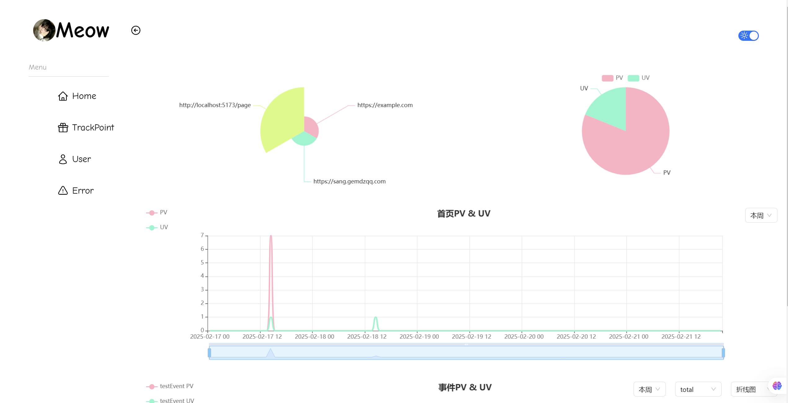

# 🐱 MeowTrackPoint - 埋点管理面板



## 📖 项目简介

**MeowTrackPoint** 是字节跳动青训营的大项目，一个功能完整的网页浏览数据分析面板。该项目实现了从数据采集、存储、分析到可视化的完整埋点解决方案。

### 🎯 核心功能

- **📊 数据可视化面板** - 支持折线图、饼图等多种图表样式
- **🎯 埋点事件管理** - 支持埋点事件的增删改查操作
- **📈 多维度数据分析** - 基于日期、事件、用户行为等维度进行筛选展示
- **🔧 埋点SDK** - 封装完整的埋点SDK，导入即可实现数据上报功能
- **🚨 错误监控** - 实时监控页面错误和白屏问题
- **👥 用户行为分析** - 用户访问路径、设备信息分析
- **⚡ 性能监控** - 页面加载性能指标监控

## 🏗️ 技术架构

### 前端技术栈
- **React 18** - 现代化前端框架
- **TypeScript** - 类型安全的JavaScript
- **Vite** - 快速构建工具
- **Tailwind CSS** - 原子化CSS框架
- **Ant Design** - 企业级UI组件库
- **ECharts** - 数据可视化图表库
- **Axios** - HTTP客户端
- **React Router** - 路由管理

### 后端技术栈
- **Node.js** - JavaScript运行时
- **Express.js** - Web应用框架
- **TypeScript** - 类型安全的JavaScript
- **MySQL** - 关系型数据库
- **Jest** - 单元测试框架
- **Nodemon** - 开发环境热重载

### 开发工具
- **pnpm** - 包管理器
- **ESLint** - 代码规范检查
- **Babel** - JavaScript编译器

## 🚀 快速开始

### 环境要求
- Node.js >= 16.0.0
- pnpm >= 9.15.4
- MySQL >= 8.0

### 安装依赖
```bash
# 安装项目依赖
pnpm install

# 安装前端依赖
cd frontend && pnpm install

# 安装后端依赖
cd backend && pnpm install
```

### 环境配置
1. 在 `backend` 目录下创建 `.env.development.local` 文件：
```env
DB_HOST=localhost
DB_USER=your_username
DB_PASSWORD=your_password
DB_NAME=your_database_name
```

2. 创建MySQL数据库并导入表结构

### 启动项目
```bash
# 同时启动前端和后端
pnpm start

# 仅启动前端
pnpm start:frontend

# 仅启动后端
pnpm start:backend
```

访问地址：
- 前端：http://localhost:5173
- 后端：http://localhost:5927

## 📋 功能模块

### 1. 数据概览 (Home)
- **PV/UV统计** - 页面访问量和独立访客数统计
- **事件分析** - 自定义事件的数据分析
- **来源分析** - 用户访问来源统计
- **实时图表** - 基于ECharts的数据可视化

### 2. 埋点管理 (TrackPoint)
- **事件配置** - 添加、删除、管理埋点事件
- **事件筛选** - 支持搜索和筛选事件
- **批量操作** - 支持批量清空和重置
- **本地存储** - 事件配置本地持久化

### 3. 用户分析 (UserList)
- **用户信息** - 用户ID、浏览器、操作系统信息
- **设备分析** - 用户设备类型和版本统计
- **访问路径** - 用户访问页面路径分析
- **筛选功能** - 支持按用户ID和浏览器筛选

### 4. 错误监控 (Error)
- **错误捕获** - 自动捕获JavaScript错误
- **白屏检测** - 页面白屏问题监控
- **错误分类** - 按错误类型进行分类统计
- **详细信息** - 错误堆栈和上下文信息

## 🔧 SDK使用指南

### 基础使用
```javascript
import StatisticSDK from './SDK/StatisticSDK';

// 初始化SDK
const sdk = new StatisticSDK('user-uuid');

// 发送自定义事件
sdk.sendList('/demo', {
    event: 'button_click',
    event_data: JSON.stringify({ buttonId: 'submit' })
});
```

### 功能特性
- **自动性能监控** - 页面加载时间、DOM渲染时间等
- **错误自动捕获** - JavaScript错误和未处理的Promise拒绝
- **白屏检测** - 自动检测页面白屏问题
- **设备信息收集** - 浏览器、操作系统、设备信息
- **防抖机制** - 防止重复事件上报
- **重试机制** - 网络请求失败自动重试

## 🧪 测试

```bash
# 运行后端测试
cd backend && pnpm test

# 运行前端代码检查
cd frontend && pnpm lint
```

## 📝 开发规范

- 使用TypeScript进行类型检查
- 遵循ESLint代码规范
- 组件采用函数式编程
- 使用Tailwind CSS进行样式开发
- 数据库操作使用参数化查询

---

⭐ 如果这个项目对您有帮助，请给我们一个星标！

